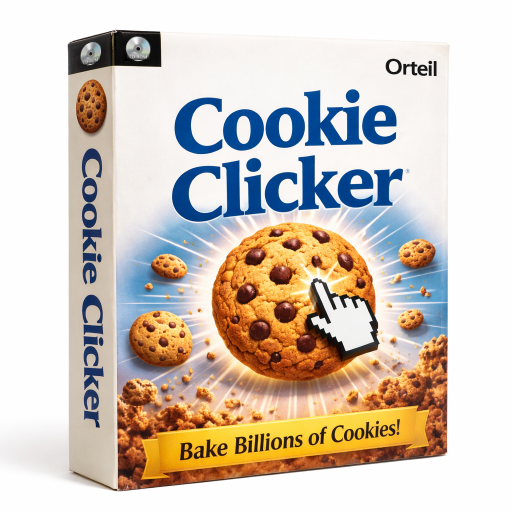

## Boss Mode for Cookie Clicker

Busy waiting for that AI Agent to mess up your work? Too tired to follow along? Like watching cookies being clicked? Don't like the boss watching?

Activate Boss Mode!

You get tables, and graphs, and everything that looks super important!

Just press Ctrl+B!

### Using in Cookie Clicker (Steam)

1. Locate your Steam Cookie Clicker install and open its `mods/local` folder.
2. Copy the `boss-mode` folder from this repo into `mods/local/BossMode` (or similar).
3. Start Cookie Clicker with mods enabled and enable **Boss Mode** in the Mods menu.
4. In-game, use:
   - The **Boss** button in the top bar to toggle the overlay.
   - The **Ctrl+B** keyboard shortcut to toggle the overlay from anywhere.

### Project Layout

- `boss-mode/`
  - `info.txt` – Steam mod metadata (copy this folder into Cookie Clicker’s `mods/local`).
  - `main.js` – registers the `boss mode` mod, loads the overlay module, wires it to the live `Game` object, adds the button and hotkey.
  - `overlay.js` – shared overlay module; renders the Boss Mode UI and talks to an abstract `gameApi` (used both in-game and in the test harness).
- `test-harness.html` – simple HTML page that loads `overlay.js` with a mock `gameApi` so you can iterate on UI and behavior in a regular browser tab.

### Testing the overlay without Cookie Clicker

1. Open `test-harness.html` in a browser (you can use a simple static file server or open it directly).
2. Use the **Boss** button or **Ctrl+B** to open the overlay.
3. The overlay will operate on a mocked list of upgrades, but uses the exact same `overlay.js` code as the real mod.
